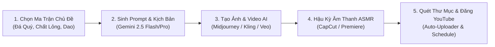

# 💎 Gemstone Fruit AI Studio

> **Bộ công cụ máy tính chuyên nghiệp tối ưu hóa quy trình sản xuất video triệu view YouTube Shorts dạng ASMR Cắt Trái Cây Đá Quý & Vật Thể Siêu Thực bằng Trí Tuệ Nhân Tạo (Gemini 2.5, Midjourney, Kling AI, Veo 2).**

---

## 🌟 Giới Thiệu Tổng Quan

**Gemstone Fruit AI Studio** là ứng dụng Desktop (Electron + React + TypeScript + Vite) được phát triển nhằm tự động hóa từ A-Z quy trình sáng tạo nội dung YouTube Shorts dạng *Satisfying / ASMR Cutting*:
- **Ma trận sáng tạo đa chủ đề:** Trái cây đá quý, Thiết bị công nghệ thạch dẻo, Hành tinh vũ trụ, Bánh ảo ảnh, Trứng rồng geode, Đại dương pha lê.
- **Tự động sinh Prompt chuẩn xác cho đa nền tảng:** Midjourney v6, ChatGPT / DALL-E 3, FLUX.1, Google Veo 2, Kling AI, Runway Gen-3, Luma Dream Machine.
- **Tự động xây dựng kịch bản SEO Viral:** Tiêu đề giật tít song ngữ (Việt/Anh), Câu hook 3 giây đầu giữ chân khán giả, Thiết kế âm thanh (Sound Design ASMR), Bộ Hashtags và Thẻ từ khóa thịnh hành.
- **Tự động quét thư mục video & Tải lên YouTube (Auto-Uploader):** Kiểm tra chuẩn Shorts (9:16, $\le$ 60s), ghép cặp kịch bản SEO, tự động đặt lịch đăng (Scheduled Upload) theo khung giờ vàng và quản lý hạn mức API (Google Quota Staging).

---

## ✨ Tính Năng Nổi Bật

### 1. 🎨 Studio Tạo Prompt Đơn Lẻ (Single Studio)
- **6 Danh Mục Chủ Đề Phong Phú:**
  - 🥑 *Trái Cây Đá Quý (Gemstone Fruits):* Bơ ngọc lục bảo, Dâu tây ruby, Dưa hấu sapphire, Thanh long thạch anh tím...
  - 📱 *Công Nghệ & Thạch (Cyber Jelly & Tech):* iPhone thạch dạ quang, Game Boy pha lê vi mạch neon...
  - 🪐 *Hành Tinh & Vũ Trụ (Cosmic Spheres):* Cắt đôi Trái Đất lõi dung nham, Sao Thổ xoáy dải ngân hà...
  - 🍰 *Ảo Ảnh Bánh & Sáp (Illusion Cakes & Wax):* Cắt thỏi vàng/gạch đá mềm như bơ lộ cốt bánh kem phát sáng...
  - 🐉 *Trứng Rồng & Geode (Dragon Eggs & Geode):* Vỏ vảy rồng bạc, tổ ong hổ phách tràn tinh chất phát quang...
  - 🌊 *Đại Dương Pha Lê (Crystal Marine Shells):* Ốc Nautilus xà cừ, sao biển thủy tinh chứa bọt sóng phát sáng...
- **Tùy biến sâu sắc:** Chọn loại đá quý, chất lỏng phát sáng bên trong (mật ong nano, vàng lỏng, dung nham rực lửa...), dụng cụ cắt (Dao Damascus nhiệt, Tia Laser Plasma, Kiếm Katana Nano...), phong cách thẩm mỹ và nền tảng AI mục tiêu.
- **Xuất bản Prompt 1-Click:** Tách riêng Prompt ảnh mở đầu (Start Frame), ảnh kết thúc (End Frame) và Prompt Video Morphing/Motion chuyển động cắt.

### 2. ⚡ Xử Lý Hàng Loạt Tự Động (Batch Queue Manager)
- Tạo nhanh 10, 20, 50 kịch bản cùng lúc hoàn toàn ngẫu nhiên hoặc theo ma trận định sẵn.
- Bộ điều phối tiến trình thông minh (Rate-Limiter & Auto-Retry) ngăn chặn việc chạm ngưỡng giới hạn (429 Too Many Requests) của Gemini API.
- Xuất dữ liệu kịch bản ra định dạng **JSON**, **CSV** hoặc **TXT** để tích hợp với các công cụ tự động hóa khác.

### 3. 📤 Tự Động Quét & Tải Video Lên YouTube (Auto-Uploader)
- **Folder Scanner:** Quét trực tiếp thư mục render video (`.mp4`, `.mov`, `.webm`) từ máy tính cá nhân.
- **Smart Media Inspector:** Tự động kiểm tra tỷ lệ khung hình (chuẩn 9:16 dọc), thời lượng video ($\le$ 60 giây), độ phân giải và cảnh báo nếu video không đạt chuẩn YouTube Shorts.
- **Smart Idea Matcher:** Tự động ghép nối video trong thư mục với kịch bản SEO tương ứng theo tên file hoặc nội dung.
- **Lên lịch đăng thông minh (Scheduled Upload):** Thiết lập lịch xuất bản tự động theo khung giờ vàng (ví dụ: 11:30 & 18:30 hàng ngày).
- **Auto Multi-Day Quota Staging:** Tự động phân bổ số lượng video đăng sang các ngày tiếp theo dựa trên hạn mức 10,000 units/ngày của YouTube Data API v3 (mỗi lần upload tốn ~1,600 units).

### 4. 📊 Bảng Điều Khiển Hạn Mức & Thống Kê (Analytics & Quota Dashboard)
- Giám sát mức tiêu thụ Quota YouTube Data API v3 theo thời gian thực (Tránh bị khóa API do vượt 10,000 units/ngày).
- Hiển thị thông tin kênh YouTube kết nối (Avatar, Tên kênh, Số lượng người đăng ký - Subscribers).
- Biểu đồ thống kê lịch sử đăng video và lịch trình dự kiến trong tương lai.

### 5. 📚 Quản Lý Lịch Sử & Cẩm Nang Sáng Tạo (History & Workflow Guide)
- Lưu trữ toàn bộ kịch bản đã tạo vào `localStorage` an toàn trên máy tính cá nhân.
- Bộ lọc tìm kiếm nhanh, đánh dấu kịch bản yêu thích (Favorites).
- Tích hợp cẩm nang 5 bước quy trình sản xuất video Shorts triệu view và lối tắt nhanh đến các nền tảng AI (Google AI Studio, Midjourney, Kling AI, Runway, Suno AI, CapCut...).

---

## 🛠️ Công Nghệ Sử Dụng (Tech Stack)

| Thành phần | Công nghệ |
| :--- | :--- |
| **Desktop Runtime** | [Electron 34](https://www.electronjs.org/) |
| **Frontend Framework** | [React 18](https://react.dev/) + [TypeScript 5](https://www.typescriptlang.org/) |
| **Build Tool & Bundler** | [Vite 6](https://vitejs.dev/) |
| **Styling** | [Tailwind CSS 3](https://tailwindcss.com/) + PostCSS + Autoprefixer |
| **Icons & Visuals** | [Lucide React](https://lucide.dev/) + [Canvas Confetti](https://www.npmjs.com/package/canvas-confetti) |
| **AI Integration** | [Google Gemini 2.5 API](https://aistudio.google.com/) (`gemini-2.5-flash`, `gemini-2.5-pro`) |
| **Video & Data APIs** | [YouTube Data API v3](https://developers.google.com/youtube/v3) (OAuth 2.0 Direct Integration) |
| **Packaging & Installer** | [Electron Builder 25](https://www.electron.build/) (Windows NSIS / Portable Installer) |

---

## 📋 Yêu Cầu Hệ Thống

- **Hệ điều hành:** Windows 10/11 (64-bit), macOS 12+, hoặc Linux.
- **Node.js:** Phiên bản `>= 18.0.0` (Khuyên dùng Node.js LTS 20.x hoặc 22.x).
- **Package Manager:** `npm` (đi kèm Node.js) hoặc `yarn` / `pnpm`.
- **API Keys cần thiết:**
  - **Google Gemini API Key:** Lấy miễn phí tại [Google AI Studio](https://aistudio.google.com/app/apikey).
  - **Google Cloud OAuth 2.0 Client Credentials** *(Tùy chọn, chỉ cần nếu dùng tính năng tự động đăng video YouTube)*: Tạo Client ID dạng Desktop App tại [Google Cloud Console](https://console.cloud.google.com/).

---

## 🚀 Cài Đặt & Chạy Ứng Dụng

### 1. Cài đặt các gói phụ thuộc
Mở Terminal tại thư mục dự án và chạy:
```bash
npm install
```

### 2. Chạy ứng dụng ở môi trường phát triển (Development Mode)

- **Khởi chạy ứng dụng Desktop Electron (Khuyên dùng):**
  ```bash
  npm run electron:dev
  ```
  *(Lệnh này sẽ tự động khởi động máy chủ Vite và mở cửa sổ ứng dụng Electron).*

- **Chạy giao diện Web trên trình duyệt:**
  ```bash
  npm run dev
  ```
  Truy cập vào địa chỉ: `http://localhost:5173`

---

## 📦 Hướng Dẫn Đóng Gói Ứng Dụng Desktop (.exe)

Để đóng gói thành bộ cài đặt hoàn chỉnh cho Windows:

```bash
npm run electron:build
```

- Hệ thống sẽ tự động dọn dẹp các tiến trình Electron cũ đang chạy (thông qua `scripts/kill-running.js`), biên dịch TypeScript cho cả Renderer và Main process, sau đó tạo file cài đặt Windows `.exe` trong thư mục:
  ```
  dist-electron-build/
  ```

---

## 📖 Hướng Dẫn Sử Dụng Chi Tiết



### Bước 1: Thiết lập Gemini API Key
1. Nhấp vào biểu tượng **Cài đặt API** (hoặc nút nhập API Key trên thanh điều hướng).
2. Dán mã Gemini API Key từ [Google AI Studio](https://aistudio.google.com/).
3. Bấm **Kiểm tra kết nối** để đảm bảo key hoạt động chính xác.

### Bước 2: Tạo Prompt & Kịch bản (Single hoặc Batch)
1. **Chế độ đơn lẻ:** Chọn danh mục $\rightarrow$ Chọn vật thể $\rightarrow$ Chọn loại đá quý $\rightarrow$ Chọn chất lỏng tuôn trào $\rightarrow$ Chọn dụng cụ cắt $\rightarrow$ Bấm **Tạo Kịch Bản & Prompt AI**.
2. **Chế độ hàng loạt:** Vào tab **Hàng Loạt (Batch Queue)** $\rightarrow$ Chọn số lượng cần tạo (ví dụ 10 kịch bản) $\rightarrow$ Bấm **Tạo ngẫu nhiên & Chạy**.
3. Sao chép các Prompt tương ứng:
   - **Start Image Prompt:** Dán vào Midjourney hoặc ChatGPT (DALL-E 3) để tạo ảnh vật thể nguyên vẹn.
   - **End Image Prompt:** Tạo ảnh mặt cắt lộ cấu trúc đá quý và chất lỏng tuôn trào.
   - **Video Morphing Prompt:** Nạp vào Google Veo 2, Kling AI hoặc Runway Gen-3 (Image-to-Video) để diễn hoạt cảnh cắt mượt mà.

### Bước 3: Đăng Video YouTube Shorts Tự Động
1. Đặt tất cả video đã render vào một thư mục trên máy tính.
2. Mở tab **Đăng YouTube (YouTube Uploader)** $\rightarrow$ Nhấp **Chọn thư mục video**.
3. Kết nối tài khoản YouTube bằng Google OAuth 2.0.
4. Kiểm tra danh sách video đã được ghép cặp tiêu đề, mô tả và hashtags chuẩn SEO.
5. Cấu hình lịch phát sóng (ví dụ: 2 video/ngày vào 11:30 và 18:30) $\rightarrow$ Bấm **Bắt đầu Tải lên & Đặt lịch**.

---

## 📁 Cấu Trúc Thư Mục Dự Án

```
Youtube-Tool/
├── electron/                 # Mã nguồn Electron Main & Preload Process
│   ├── main.ts              # Xử lý cửa sổ, Native Dialogs, IPC Handlers
│   └── preload.ts           # Cầu nối an toàn ContextBridge giữa Electron và React
├── scripts/
│   └── kill-running.js      # Script đóng tiến trình Electron cũ khi build
├── src/                      # Mã nguồn ứng dụng React
│   ├── components/          # Các Component giao diện chính
│   │   ├── Header.tsx                # Thanh điều hướng và cài đặt API Key
│   │   ├── MatrixSelector.tsx        # Ma trận lựa chọn chủ đề & đá quý
│   │   ├── PromptOutputCard.tsx      # Hiển thị kịch bản, prompt ảnh & video, SEO
│   │   ├── BatchQueueManager.tsx     # Quản lý hàng đợi tạo hàng loạt
│   │   ├── HistoryView.tsx           # Lịch sử và bộ sưu tập yêu thích
│   │   ├── YouTubeUploaderView.tsx   # Quét thư mục & tải video lên YouTube
│   │   ├── AnalyticsDashboardView.tsx# Biểu đồ hạn mức API & kênh YouTube
│   │   ├── DirectLinksModal.tsx      # Lối tắt nhanh tới các công cụ AI
│   │   └── TipsGuideModal.tsx        # Hướng dẫn quy trình sản xuất video
│   ├── data/
│   │   └── gemstoneMatrix.ts         # Cơ sở dữ liệu ma trận vật thể, đá quý, hiệu ứng
│   ├── services/            # Tầng dịch vụ logic & API
│   │   ├── geminiService.ts          # Kết nối và sinh prompt với Gemini API
│   │   ├── youtubeService.ts         # Tích hợp YouTube Data API v3 & OAuth 2.0
│   │   ├── quotaService.ts           # Quản lý & tính toán hạn mức Quota
│   │   ├── mediaService.ts           # Kiểm tra định dạng, độ dài, chuẩn Shorts
│   │   ├── queueService.ts           # Quản lý hàng đợi tác vụ hàng loạt
│   │   └── exportService.ts          # Xuất dữ liệu JSON / CSV / TXT
│   ├── types/               # Khai báo TypeScript Interfaces & Types
│   ├── App.tsx              # Component trung tâm điều phối Tab
│   ├── main.tsx             # Điểm khởi chạy React DOM
│   └── index.css            # Cấu hình Tailwind CSS
├── electron-builder.json5   # Cấu hình đóng gói ứng dụng Desktop Windows
├── package.json             # Danh sách dependencies và npm scripts
├── tsconfig.json            # Cấu hình TypeScript cho React
├── tsconfig.electron.json   # Cấu hình TypeScript cho Electron
├── vite.config.ts           # Cấu hình máy chủ phát triển Vite
└── .gitignore               # Cấu hình loại trừ file nhạy cảm và thư mục build
```

---

## 🔒 Bảo Mật & An Toàn Dữ Liệu (Security & Privacy)

- **Lưu trữ cục bộ (Local Storage):** Mọi thông tin nhạy cảm bao gồm **Gemini API Key**, **Google OAuth Tokens**, và **Lịch sử kịch bản** đều được lưu trữ trực tiếp trên thiết bị của bạn (`localStorage` / Electron local environment), tuyệt đối không gửi về bất kỳ máy chủ trung gian nào.
- **Git Protection:** Tệp `.gitignore` đã được cấu hình chặt chẽ để loại trừ toàn bộ file `.env`, `credentials.json`, `token.json`, `client_secret*.json` nhằm đảm bảo không bao giờ vô tình đẩy khóa bảo mật lên kho mã nguồn công khai.

---

## 📄 Bản Quyền & Tác Giả

- **Tác giả:** Triet ([trietngo-dev](https://github.com/trietngo-dev))
- **Dự án:** Gemstone Fruit AI Studio © 2026.
- Được thiết kế và tối ưu cho cộng đồng nhà sáng tạo nội dung YouTube Shorts quốc tế.
